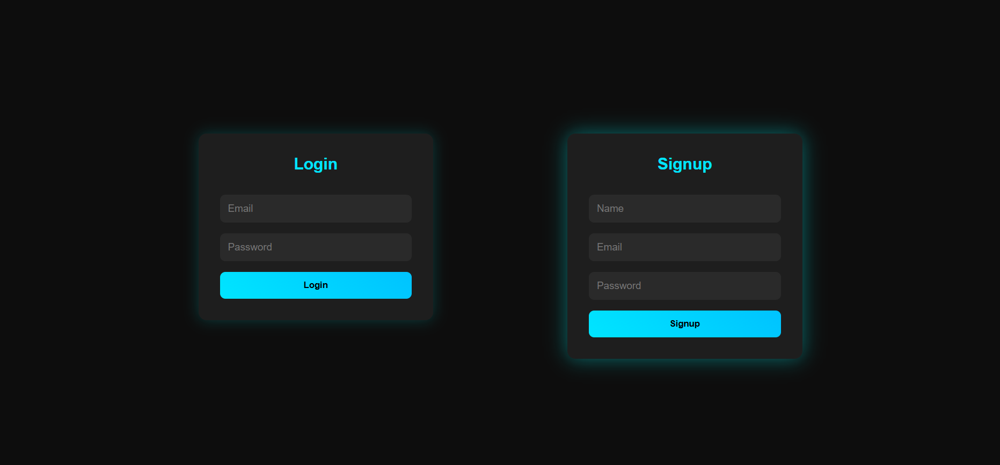
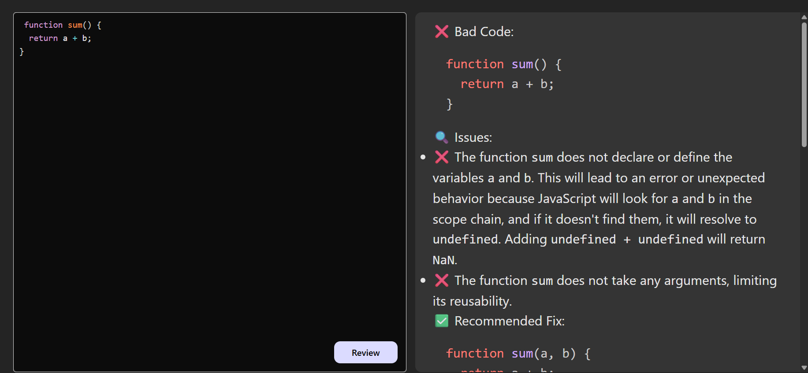

#  AI Code Review Platform  

An **AI-powered code review application** built with **React.js, Node.js, Express.js**, and **Google Gemini API**.  
This tool allows developers to paste or upload their code and get **instant AI-generated reviews, suggestions, and improvements** for better code quality.  

---

##  Features  
-  **Google Sign-In (Optional)** – Secure login for personalized experience.  
-  **AI-Powered Code Review** – Uses **Google Gemini API** to analyze code.  
-  **Full-Stack Application** – React.js frontend + Node.js/Express backend.  
-  **RESTful API** – Backend API integrates with Google Gemini securely.  
-  **Responsive UI** – Clean and user-friendly design with React.  
-  **Secure Configuration** – `.env` file for API keys and sensitive credentials.  

---

## 🛠 Tech Stack  
- **Frontend:** React.js, TailwindCSS/Material UI  
- **Backend:** Node.js, Express.js  
- **AI Model:** Google Gemini API  
- **Other Tools:** dotenv, axios, nodemon  

---

## Screenshot




## ⚙️ Installation  

Clone the Repository  
```shell
git clone https://github.com/priya2001/AI-code-Review
cd chat-app-react-nodejs
```

Now install the dependencies
```shell

npm i
```

Create a .env file inside BackEnd:
```shell

API_KEY=your_google_gemini_api_key
PORT=5000
```


For Frontend.
```shell
cd Frontend
npm run dev
```
For Backend.

Open another terminal in folder:
```shell
cd Backend
npm start
```
Done! 
Now open localhost:5000 in your browser.


